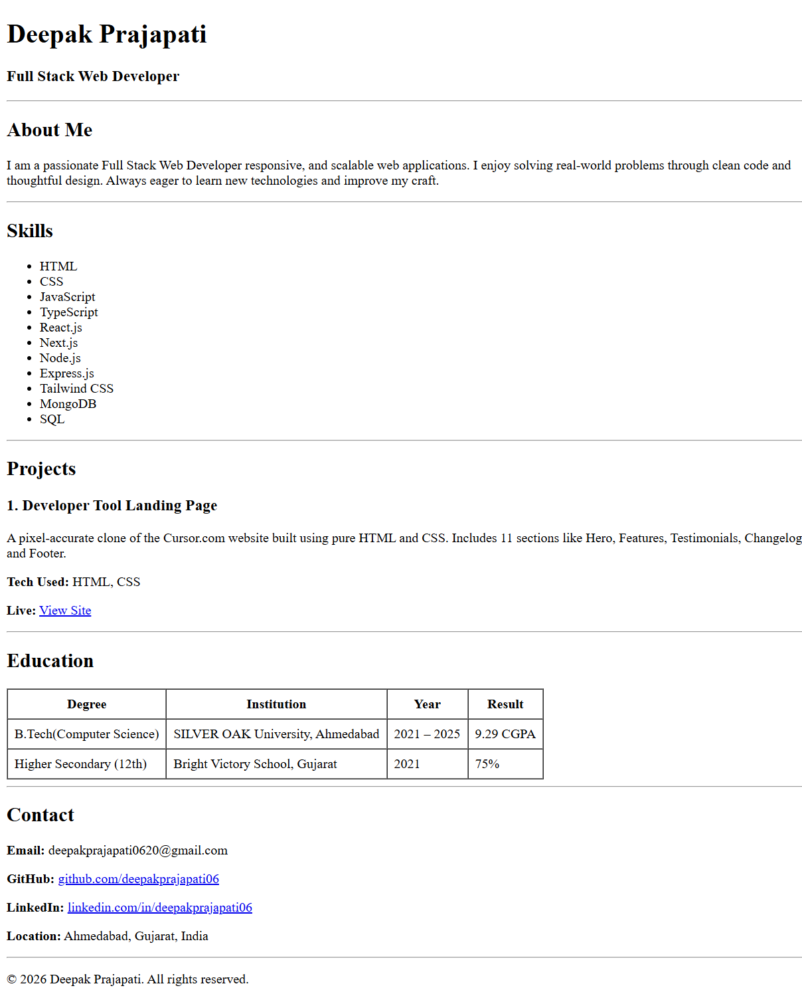

# HTML Resume - Deepak Prajapati

> A single-page resume website built with pure HTML — no CSS, no frameworks, no JavaScript.

---

## Sections Included

| # | Section | Description |
|---|---------|-------------|
| 1 | **Header** | Name and Job Title |
| 2 | **About Me** | Short personal introduction |
| 3 | **Skills** | Unordered list of technical skills |
| 4 | **Experience** | Table with job title, company, duration, description |
| 5 | **Projects** | 3 projects with tech stack and links |
| 6 | **Education** | Table with degree, institution, year, result |
| 7 | **Contact** | Email, GitHub, LinkedIn, Location |

---

## Tech Stack

- **HTML5** only
- No CSS
- No JavaScript
- No frameworks or libraries

---

## Project Structure

```
html-resume/
└── index.html      # Complete resume in a single HTML file
```

---

## Setup & Usage

1. Clone the repository:
   ```
   git clone https://github.com/deepakprajapati06/html-resume.git
   ```
2. Open the folder
3. Double-click `index.html` — opens directly in any browser

No installation, no dependencies, no build steps required.

---

## Screenshots



---

*Built as part of a frontend assignment to create a resume webpage using only HTML.*
